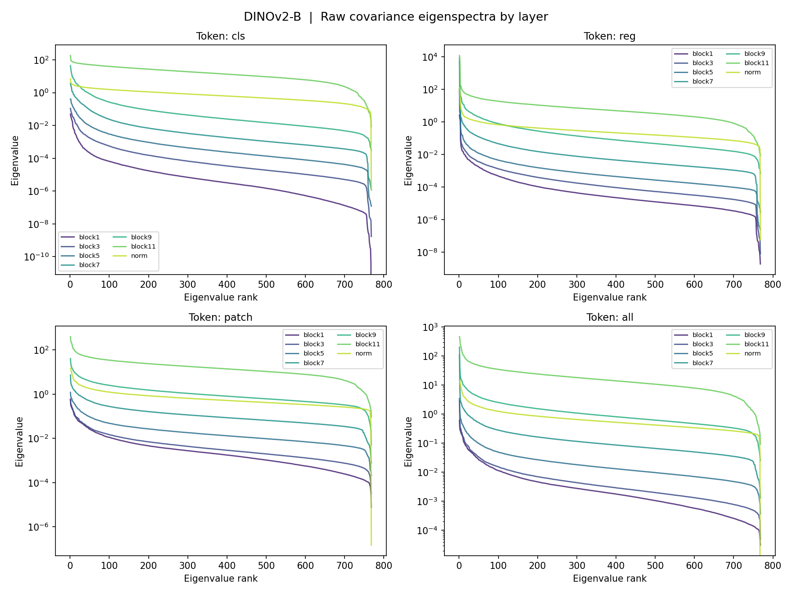
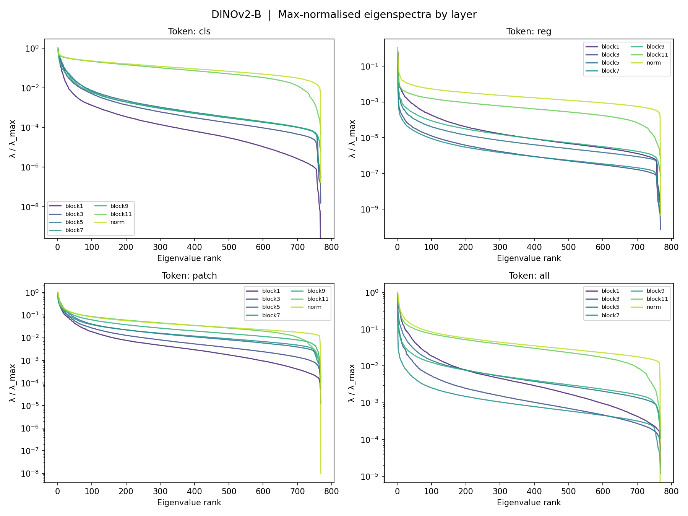
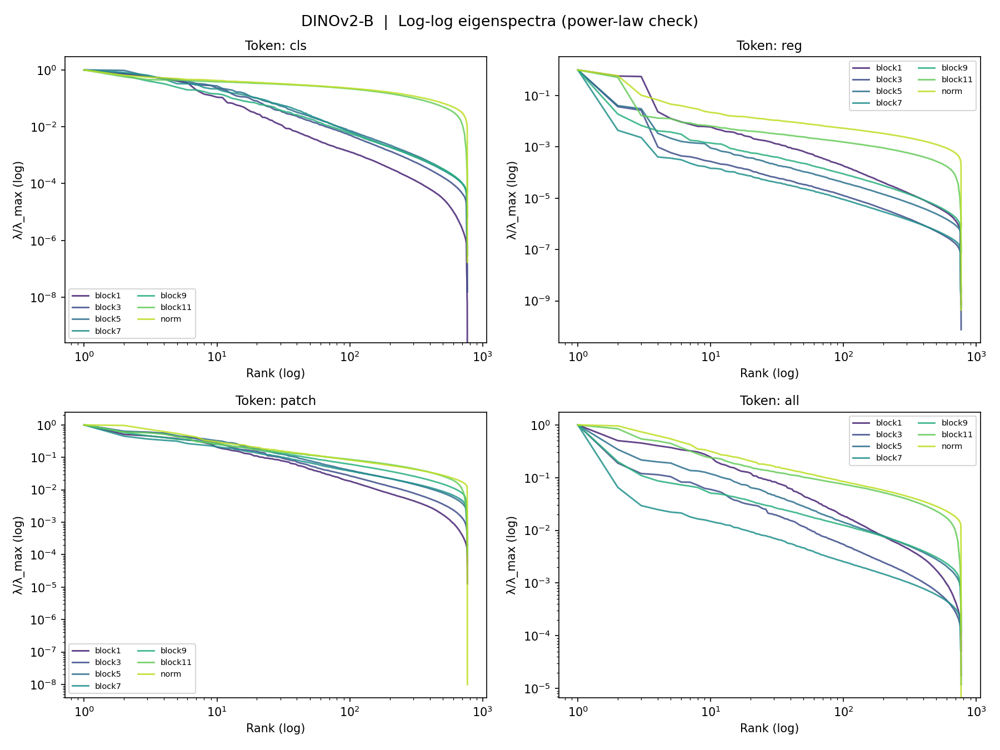
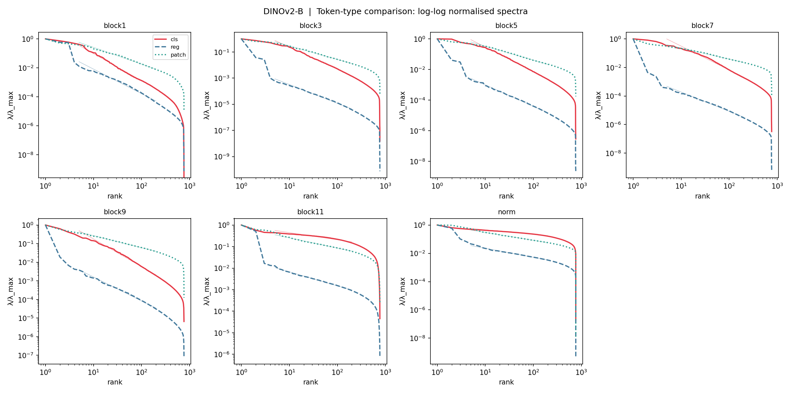
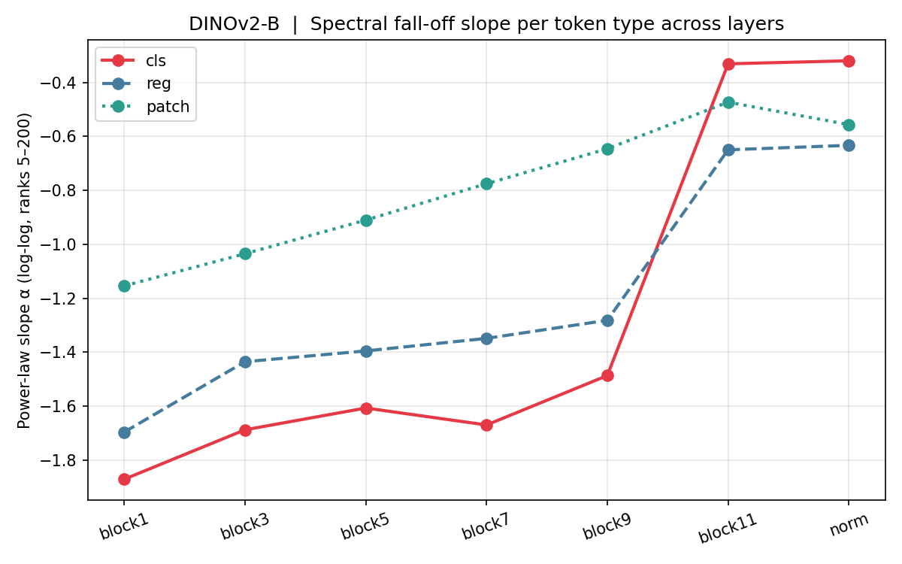
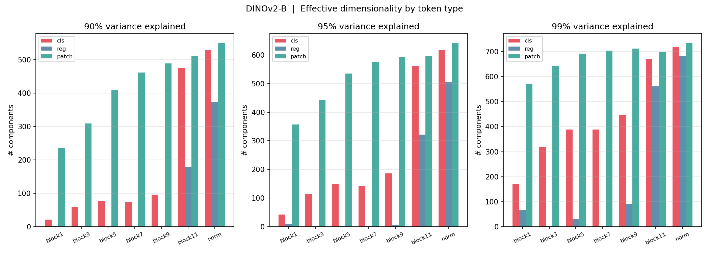
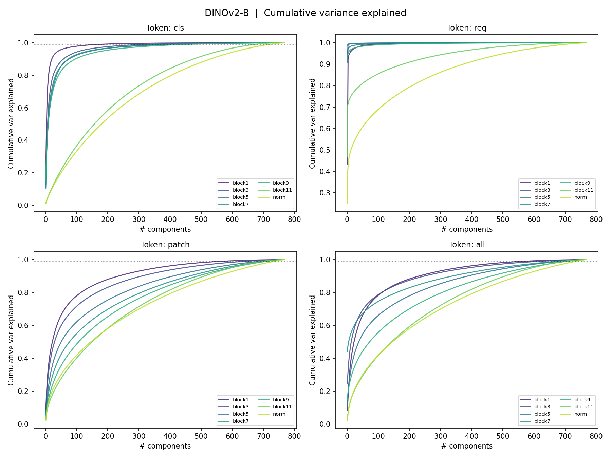

# DINOv2-B Covariance Eigenspectrum Analysis on ImageNet-1K

**Date:** April 14, 2026
**Model:** DINOv2 ViT-B/14 with registers (`dinov2_vitb14_reg`)
**Dataset:** ImageNet-1K train split (1,281,167 images)
**Data location:** `$STORE_DIR/DL_Projects/DINOv2_ImageNet1k_Covariance/`

---

## Setup

**Token layout** (261 tokens per image, patch size 14 → 16×16 = 256 patches):

| Index | Type | Count |
|-------|------|-------|
| 0 | CLS token | 1 |
| 1–4 | Register tokens | 4 |
| 5–260 | Patch tokens | 256 |

**Layers analysed:** blocks 1, 3, 5, 7, 9, 11 (intermediate transformer blocks) and `norm` (final LayerNorm output).

**Per-layer outputs:** For each layer × token type (cls / reg / patch / all), we computed:
- Mean vector: shape `(768,)`
- Covariance matrix: shape `(768, 768)`, fp32
- Sample count `n`

**Sample counts:**

| Token type | N samples |
|-----------|-----------|
| cls | 1,281,167 |
| reg | 5,124,668 |
| patch | 328,618,752 |
| all | 334,384,587 |

**Compute:** A100 40GB, batch size 2048, fp16 autocast, ~26 min total.
**Numerics:** Inputs upcast to fp32 before accumulation; running normalized estimator (tracks E[x] and E[xxᵀ]) to prevent overflow.

---

## Results

### 1. Raw eigenspectra

Eigenvalues of the covariance matrix, sorted descending, for each layer and token type.

---

### 2. Max-normalised eigenspectra (semi-log)

Each spectrum divided by its largest eigenvalue (λ/λ_max). Reveals relative fall-off shape independent of absolute scale.

---

### 3. Log-log spectra — power-law check

A straight line in log-log indicates a power-law decay λₖ ∝ k^α. Dashed overlays show fitted lines (ranks 5–200).

**Power-law slope α (log-log fit, ranks 5–200):**

| Layer | cls | reg | patch | all |
|-------|-----|-----|-------|-----|
| block1 | -1.870 | -1.696 | -1.154 | -1.169 |
| block3 | -1.687 | -1.435 | -1.035 | -1.076 |
| block5 | -1.607 | -1.395 | -0.910 | -0.921 |
| block7 | -1.669 | -1.348 | -0.775 | -0.792 |
| block9 | -1.486 | -1.281 | -0.646 | -0.656 |
| block11 | -0.331 | -0.650 | -0.473 | -0.493 |
| norm | -0.320 | -0.633 | -0.556 | -0.561 |

**Observations:**
- Early–mid layers (blocks 1–9) follow a clear power law. Patch tokens have the shallowest slope (most distributed); CLS is steepest (most low-rank).
- CLS/patch slope ratio grows from ~1.6× at block1 to ~2.3× at block9 — CLS becomes progressively more concentrated as depth increases.
- **Block11/norm: dramatic flip** — CLS slope collapses from -1.49 → -0.33, becoming the *flattest* token. LayerNorm at the end strongly redistributes CLS variance, likely for downstream task readout.

---

### 4. Token-type comparison per layer

All three token types overlaid per layer, with power-law fit lines.

---

### 5. Spectral slope across depth

How the power-law slope α evolves from block1 → norm for each token type.

**Key pattern:** All token types flatten monotonically through blocks 1–9. Then at block11 there is a sharp discontinuity — especially for CLS (drops from -1.49 to -0.33). Register tokens also flatten considerably (-1.28 → -0.65). Patch tokens change more smoothly.

---

### 6. Effective dimensionality

Number of principal components needed to explain 90%, 95%, and 99% of total variance.

**90% variance threshold:**

| Layer | cls | reg | patch |
|-------|-----|-----|-------|
| block1 | 21 | 3 | 235 |
| block3 | 58 | 1 | 309 |
| block5 | 76 | 1 | 410 |
| block7 | 73 | 1 | 462 |
| block9 | 96 | 1 | 489 |
| block11 | 475 | 178 | 511 |
| norm | 530 | 373 | 551 |

**Observations:**
- **Register tokens are ultra-low-rank in early layers** (1–3 dims for 90% variance in blocks 3–9), then abruptly expand to 178–373 dims at block11/norm. Suggests registers serve a very concentrated, specialised role in early–mid processing.
- **CLS** needs only 21–96 dims (90% var) through blocks 1–9, then explodes to ~530 dims at the norm layer.
- **Patch tokens** grow steadily more distributed (235 → 551 dims) — each additional layer spreads information more evenly across dimensions.

---

### 7. Cumulative variance explained

---

## Summary

| | Early layers (1–9) | Block11 / norm |
|--|--|--|
| Dominant structure | Power-law spectrum, steep | Flat spectrum, power-law breaks down |
| CLS | Most low-rank token | Becomes *most distributed* (flip) |
| Reg | Extremely low-rank (1–3 dims) | Expands sharply to ~180–370 dims |
| Patch | Shallowest slope, steadily flattening | Continues trend, ~550 dims for 90% var |
| Interpretation | Hierarchical compression | LayerNorm redistributes for readout |

The **block11 → norm transition** is the most salient feature: all token types undergo a discontinuous flattening of their spectra, most dramatically for CLS. This is consistent with the final norm layer serving as a normalisation stage that prepares features for the projection head, equalising variance across dimensions.
